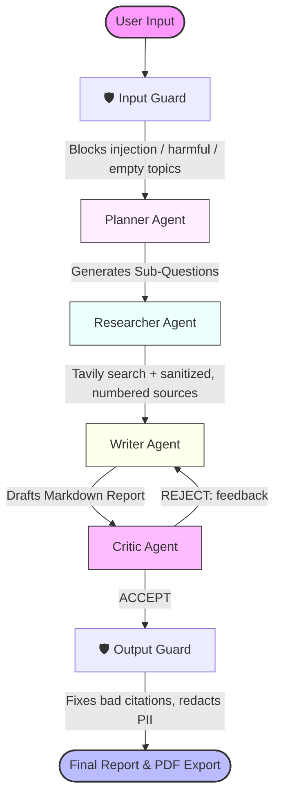

# 🧠 Multi-Agent AI Research Assistant

An AI-powered research tool that generates structured, citation-backed reports using a multi-agent pipeline.

---


---

## 🚀 Live Demo

🔗 [Demo](https://multi-agent-research-system-hemam.streamlit.app/)

---

## 📌 Overview

This project simulates a **multi-agent research system** where different AI agents collaborate to produce high-quality research reports from real-time web data.

### 📐 System Architecture

The workflow is orchestrated using **LangGraph** to ensure clean state transitions and structured coordination between specialized agents:



The system follows a structured pipeline:
* **Planner** → Breaks the main research topic down into target research questions.
* **Researcher** → Fetches real-time web data for each question.
* **Writer** → Compiles search results into a cohesive, cited report.
* **Critic** → Accepts and polishes the report, or rejects it with feedback for another draft.
* **Guardrails** → Check the topic on the way in, web content in the middle, and the report on the way out.

---

## ✨ Features

* 🧠 **Multi-agent Architecture**: Dedicated Planner, Researcher, Writer, and Critic modules.
* 🔄 **LangGraph-based Orchestration**: Stateful agentic workflow rather than rigid sequential chains.
* 🌐 **Real-time Web Search**: Leverages Tavily API for highly accurate, search-engine-optimized retrieval.
* 🤖 **Gemini 2.5 LLM Engine**: Powered by Google's cutting-edge `gemini-2.5-flash-lite` for blazing-fast inference and high accuracy.
* 📚 **Citation-Backed Generation**: Automatically embeds inline citation numbers (`[1]`, `[2]`) pointing to sources.
* 🎛 **Depth Modes**: Toggle between `Basic` and `Advanced` search depth.
* ⚡ **Caching**: Smart caching of graph runs to optimize tokens and speed.
* 📄 **PDF Export**: Instant ReportLab-based PDF compile and download button.
* 🌐 **Interactive Streamlit Web UI**: Premium dark/light responsive interface.
* 🛡 **Guardrails**: Input validation, prompt-injection filtering of web content, citation and PII checks on output, and an LLM-call budget.
* 📏 **Evaluations**: A dataset of topics scored by code-based metrics, an LLM-as-judge and [Ragas](https://docs.ragas.io/) (faithfulness, context relevance), with run-to-run comparison.
* 🧪 **Test Harness**: Swappable LLM and search backends, per-node tracing, and a 40+ test offline `pytest` suite.

---

## 🛠 Tech Stack

* **Language**: Python >= 3.13
* **Orchestration**: LangGraph
* **Inference Engine**: Google GenAI SDK (`google-genai`)
* **Search Engine**: Tavily Search API
* **Web Frontend**: Streamlit
* **Document Compilation**: ReportLab

---

## 📸 Screenshots


---

## 🎯 Key Engineering Highlights

* **Modular Agent Design**: Separation of agent concerns makes adding new nodes or tweaking prompts incredibly straightforward.
* **Real-time Data Grounding**: Minimizes model hallucinations by basing generations strictly on retrieved web source material.
* **Robust Execution**: Designed with retry logic for LLM interfaces to withstand transient API connection glitches.

---

## ⚠️ Current Limitations

* Depends on external API rate limits (Tavily and Gemini).
* PDF generation is optimized for text; raw HTML characters in generation can occasionally conflict with rendering.
* Demo version has search-depth limits.

---

## 🚀 Future Improvements

* Add a moderation model on top of the regex-based input guardrails.
* Run the offline test suite and eval smoke test in CI (GitHub Actions).
* Store historical research runs in local SQLite/PostgreSQL.
* Support uploading custom PDF reference files as context.

---

## ⚙️ Installation & Setup

Ensure you have [Python 3.13+](https://www.python.org/) installed. We recommend using `uv` for lightning-fast package management.

### 1. Clone the repository

```bash
git clone https://github.com/hemampandey/Multi-Agent-Research-System.git
cd Multi-Agent-Research-System
```

### 2. Install dependencies

```bash
pip install -r requirements.txt
```

### 3. Add Environment Variables

Create a `.env` file in the root directory:

```env
GEMINI_API_KEY=your_gemini_api_key_here
TAVILY_API_KEY=your_tavily_api_key_here
```

### 4. Run the Streamlit Application

```bash
streamlit run streamlit_app.py
```

---

## 🛡 Evaluations, Guardrails & Harness

New to these ideas? Start with **[docs/LEARNING.md](docs/LEARNING.md)**. It explains each concept, where it lives in the code, and gives exercises.

```bash
# Tests: fake LLM + fake search, no API keys needed, runs in under a second
uv run pytest

# Evals offline: checks that the eval machinery works, for free
uv run python -m evals.run_evals --offline

# Evals for real: scores actual reports and compares with the previous run
uv run python -m evals.run_evals
uv run python -m evals.run_evals --only rag-basics --no-judge

# Add Ragas metrics (faithfulness, context relevance); install them once first
uv sync --group evals
uv run python -m evals.run_evals --ragas --only crispr-agriculture

# CLI run that saves a full JSON trace to runs/
uv run python -m app.main "Solid-state batteries" --mode Basic
```

Optional environment variables: `MODEL_NAME` (pipeline model, default `gemini-2.5-flash-lite`) and `JUDGE_MODEL_NAME` (eval judge and Ragas, default `gemini-2.5-flash`).

> **Free-tier quota:** Gemini's free tier allows about 20 requests per model per day. One report uses 3–6 requests, the judge 1 more, and Ragas about 4 more. Use `--only` to run a few cases at a time.
